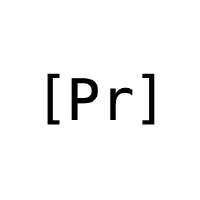

<p align="center">
  
</p>

<h1 align="center">causal-jepa</h1>

<p align="center">
  <b>Causal-axis JEPAs on prediction-market strike ladders</b><br>
  A negative result, and the diagnostics that failed to predict it.
</p>

<p align="center">
  <a href="https://github.com/physicalreasoning/causal-jepa/actions/workflows/tests.yml"></a>
  <a href="LICENSE"></a>
  
  
  <a href="FINDINGS.md"></a>
  <a href="docs/RESEARCH_PLAN.md"></a>
</p>

---

A joint-embedding predictive architecture trained on Kalshi strike ladders does not learn a
representation that beats raw features. We pre-registered four explanations for why; three were
refuted, and the fourth only surfaced after decomposing the metric everything had been ranked by.

The programme is closed. It is published because the way it failed is more useful than the way it
would have succeeded.

## Results

| | |
|---|---|
| Is the copy diagnostic an artefact of our own encoder? | **No.** Causal-target ablation, 4 seeds, Welch *t* = 0.09 |
| Does more training help? | **No.** 32× compute drives the MLP probe 23 pooled SD *below* an untrained encoder |
| Does effective rank track quality? | **No.** It nearly triples while utility falls |
| Do anti-collapse regularisers prevent copying? | **Yes**, once actually in the gradient. And it buys nothing |
| Does the copy diagnostic predict utility? | **No.** Over a 0.198 range its correlation with probe R² is **+0.390**, the wrong sign |
| Is the objective broken? | **No.** On a simulator with real hidden state it wins, and wins by more as noise rises |
| So why did it fail? | The probe target set contained no recoverable hidden state |

The headline number, and the one that reframed everything else:

```
                              ridge R²      MLP R²
raw features, full window      +0.5091     +0.5586     <- nothing beats this
JEPA, best readout             +0.4529     +0.4213
untrained encoder, same width  +0.4423     +0.4102     <- almost all of it is width
```

On `log_return_to_settle`, the only genuinely future target, **all 16 arms land in
[−0.004, +0.051]**: raw data, untrained encoders and every trained model alike. Nearly the whole
apparent gap sits in a target the corpus code itself documents as *"derivable from the input ...
low R² means broken, not interesting."* The metric was largely measuring input reconstruction.

Full record with every table, objection and falsification criterion: **[FINDINGS.md](FINDINGS.md)**.

## Install

```bash
git clone https://github.com/physicalreasoning/causal-jepa && cd causal-jepa
python3 -m venv .venv && source .venv/bin/activate
pip install -r requirements.txt
```

Python 3.11+, PyTorch 2.6. Developed on Apple Silicon (MPS); CUDA and CPU work.

## Data

The corpus is 25,818 windows of reconstructed 24-strike ladders over settled Kalshi hourly crypto
events. It is not committed, but it is fully rebuildable from Kalshi's **unauthenticated** public
API, with no key, no account and no credential:

```bash
python3 scripts/build_corpus.py --series KXBTCD --max-events 2000
```

Kalshi events settle and roll, so a corpus rebuilt today covers different events than the snapshot
in `results/`. A rebuild reproduces the *method* and should reproduce the qualitative findings; it
will not reproduce the fourth decimal. For exact reproduction, point at the original snapshot with
`export PM_JEPA_ROOT=/path/to/pm-jepa`.

With no corpus at all, 36 of the 49 tests still run and 13 skip.

## Reproduce

The five experiments, in the order they ran. Each maps to a finding in
[FINDINGS.md](FINDINGS.md), writes `results/<name>.json` with its full config inlined, and prints
its pre-registered gate outcome.

```bash
python3 scripts/readout_ablation.py    --seeds 4                 # is the readout hiding it?     10 min
python3 scripts/convergence.py         --seeds 3 --steps 19200   # does more training help?      2.7 h
python3 scripts/regulariser_sweep.py   --seeds 3 --steps 600     # do the regularisers work?     1.4 h
python3 scripts/sim_vs_real.py         --seeds 2                 # simulator vs market           see below
python3 scripts/target_decomposition.py                          # what is the metric made of?   instant
```

Supporting runs: `benchmark.py` (all controls in one table, 1 min), `cache_bench.py` (cache
scaling, no training), `h1_weightmatched.py` (the leak measured at fixed weights, 1 min),
`experiment.py` (the original 2x2 ablation, 20 min per masking strategy), `build_corpus.py`
(rebuild the data), `smoke.py` (30-step end-to-end check, seconds).

Timings are wall clock on an M2 Max via MPS, read from the `seconds` fields in the committed
results rather than estimated. `sim_vs_real.py` is the exception: it never recorded per-run
timings, so it has no verified figure here. It trains 12 models at 1,500 steps on the simulator
and took roughly an hour and a half when we ran it. Expected values and what to check when a number differs are in
[docs/REPRODUCE.md](docs/REPRODUCE.md).

## Method

A PatchTST backbone [[4]](#references) is replaced with a factorised encoder so the time axis can
be masked and cached: **strike attention** within a patch, always bidirectional because a strike
ladder is a cross-section rather than a sequence, alternating with **time attention** across
patches, causal or bidirectional per flag. The context and target towers carry independent
causality flags, which is what makes the central ablation a 2x2 rather than a single switch.
Causality also makes incremental encoding exact, so `causaljepa/cache.py` implements a KV cache
for the time-attention sublayers in the manner of segment-level recurrence [[5]](#references).

A JEPA cannot be evaluated by its own loss, since that loss lives in a space the model controls
and an identity encoder scores well on it. Evaluation freezes the encoder and probes against
exogenous targets [[6]](#references), reporting ridge (is the information linearly accessible)
alongside MLP (is it there at all). Three controls run against every arm:

- **raw features** at several widths, including an exact reproduction of the predecessor's
  identity baseline;
- **dimension-matched controls**, because any comparison across differing readout width is
  untrustworthy until width is matched. This caught two false positives that otherwise looked
  like real effects;
- **an untrained encoder** of identical architecture at the same seeds. This is the one that
  mattered most: a model that cannot separate from its own initialisation has learned nothing,
  and no earlier result in this programme had ever run it.

[docs/RESEARCH_PLAN.md](docs/RESEARCH_PLAN.md) states every decision gate before its experiment
ran, along with a kill criterion for the programme as a whole. Two gates turned out to be
mis-specified and would have produced the wrong conclusion if followed literally. Both are
recorded as originally written, with the correction beside them rather than replacing them.

## Layout

```
causaljepa/       model, cache, masking, diagnostics, regularisers, probes, corpus builder
scripts/          one experiment per file, each writing results/<name>.json
results/          every raw result, full config inlined
FINDINGS.md       the findings record, corrections included
docs/
  RESEARCH_PLAN.md  pre-registered gates and the kill criterion
  EVALS.md          the evaluation protocol and what each measurement cannot tell you
  REPRODUCE.md      exact commands, runtimes and expected values
  SPEC.md           the interface contract the implementation was built against
```

## Limitations

One corpus, one asset class, one venue. 1.8M parameters. The negative result is about *this target
set*, not prediction markets in general: a target with genuine hidden state, such as realised
volatility over a future window or the settlement of a correlated market, has not been tried. That is what
would restart this, not a bigger model.

## References

1. Assran et al. *I-JEPA.* [arXiv:2301.08243](https://arxiv.org/abs/2301.08243), 2023.
2. Bardes et al. *V-JEPA.* [arXiv:2404.08471](https://arxiv.org/abs/2404.08471), 2024.
3. Balestriero & LeCun. *LeJEPA.* [arXiv:2511.08544](https://arxiv.org/abs/2511.08544), 2025. SIGReg is reimplemented from the paper; the reference implementation is CC BY-NC 4.0 and is not vendored.
4. Nie et al. *PatchTST.* [arXiv:2211.14730](https://arxiv.org/abs/2211.14730), 2022.
5. Dai et al. *Transformer-XL.* [arXiv:1901.02860](https://arxiv.org/abs/1901.02860), 2019.
6. Alain & Bengio. *Linear Classifier Probes.* [arXiv:1610.01644](https://arxiv.org/abs/1610.01644), 2016.
7. Bardes, Ponce & LeCun. *VICReg.* [arXiv:2105.04906](https://arxiv.org/abs/2105.04906), 2021.
8. Grill et al. *BYOL.* [arXiv:2006.07733](https://arxiv.org/abs/2006.07733), 2020.

## Citation

```bibtex
@misc{causaljepa2026,
  title  = {Causal-axis JEPAs on prediction-market strike ladders:
            a negative result and the diagnostics that failed to predict it},
  author = {Physical Reasoning},
  year   = {2026},
  url    = {https://github.com/physicalreasoning/causal-jepa}
}
```

Apache 2.0. See [LICENSE](LICENSE).
